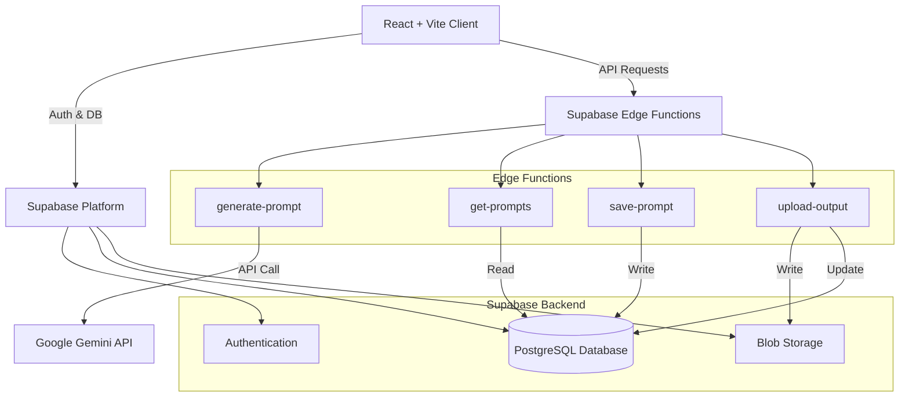

# PromptCraft Fusion

A professional, full-stack environment for prompt engineering, management, and optimization.

**Live Demo:** [https://promptcraft-fusion.netlify.app/](https://promptcraft-fusion.netlify.app/)

## System Architecture



## Core Workflows

1. **Prompt Generation:** Users submit a base concept. The `generate-prompt` edge function securely interfaces with the Gemini API to return a highly optimized prompt tailored for specific target models (ChatGPT, Claude, Gemini).
2. **Vault Storage:** Optimized prompts are persisted to the PostgreSQL database via the `save-prompt` edge function, capturing the original input, generated output, and usage metrics.
3. **Multimedia Linking:** Users can upload result artifacts (images, documents, text) generated by their prompts. The `upload-output` edge function securely stores the artifact in Supabase Storage and updates the database record.

## Technology Stack

- **Frontend:** React, TypeScript, Vite, Tailwind CSS, shadcn/ui, Framer Motion
- **Backend (BaaS):** Supabase (PostgreSQL, Auth, Storage)
- **Serverless Compute:** Deno-based Supabase Edge Functions
- **AI Integration:** Google Gemini 1.5 API

## Local Development Setup

### Prerequisites
- Node.js (v18+)
- Supabase CLI (`npm i -g supabase`)
- Google Gemini API Key

### Installation

1. **Clone the repository**
   ```bash
   git clone <repository-url>
   cd promptcraft-fusion
   ```

2. **Install dependencies**
   ```bash
   npm install
   ```

3. **Environment Configuration**
   Create a `.env` file in the project root containing your client keys:
   ```env
   VITE_SUPABASE_URL="<your-supabase-url>"
   VITE_SUPABASE_PUBLISHABLE_KEY="<your-supabase-anon-key>"
   ```

4. **Start the Development Server**
   ```bash
   npm run dev
   ```

## Edge Functions Deployment

Backend operations (database reads/writes and 3rd-party API integrations) are executed in secure, isolated Edge Functions. To deploy them to your remote Supabase project:

1. **Link your Supabase project**
   ```bash
   supabase link --project-ref <your-project-ref>
   ```

2. **Set the Gemini API Key secret securely**
   ```bash
   supabase secrets set GEMINI_API_KEY="<your-api-key>"
   ```

3. **Deploy the functions**
   ```bash
   supabase functions deploy generate-prompt
   supabase functions deploy get-prompts
   supabase functions deploy save-prompt
   supabase functions deploy upload-output
   ```